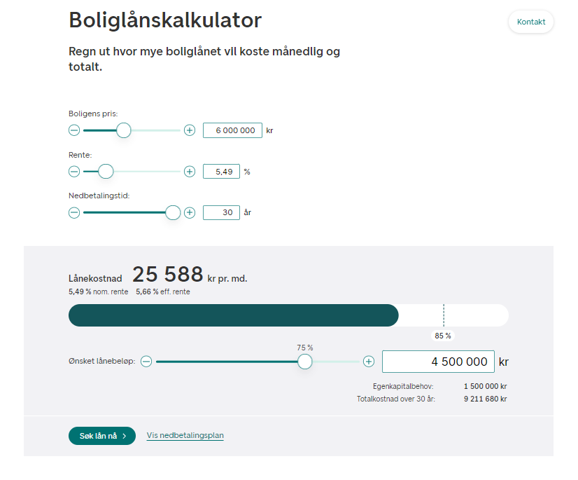
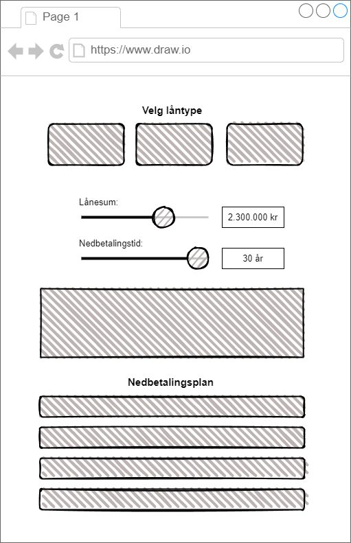

# Aritma Task

This project is a simple application designed to calculate the cost of a 
housing loan, and generate a monthly payback plan. The backend is 
implemented with ASP.NET Core Web API using C#, and the frontend is a 
single-page application (SPA).

## Table of Contents
- [Frontend](#frontend)
    - [Design](#design)
- [Backend](#backend)
    - [Architecture](#architecture)
    - [API Endpoints](#api-endpoints)
    - [Testing](#testing)
- [Setup](#setup)


# Frontend

The frontend of this application is designed to provide a user-friendly 
interface for calculating housing loan costs. Users can specify the desired
amount and the payback time in years.

## Design

The frontend design is inspired by various online loan calculators and is 
structured to be intuitive and easy to use.

|                          Inspiration                           |                Wireframe                |
|:--------------------------------------------------------------:|:---------------------------------------:|
|                       |  |
|Taken from [DNB.no](https://www.dnb.no/lan/kalkulator/boliglan) | Made with [draw.io](https://draw.io)    |


# Backend

The backend is implemented in ASP.NET Core and contains all the business 
logic for loan calculations. It is structured to be easily extendable to 
support different types of loans and payback schemes.

## Architecture

The backend architecture follows a layered approach, ensuring a separation
of concerns and facilitating maintenance and scalability.


### Layers Description

- **API Layer**: Handles HTTP requests and responses.
- **Service Layer**: Contains business logic and communicates with the repositories.
- **Repository Layer**: Handles data access and communicates with the database.
- **Database Layer**: Represents the database schema and is managed using Entity Framework.


## API Endpoints

The following table lists the API endpoints available in this application along with their descriptions:

| Endpoint                | Method | Description                                                      |
|-------------------------|--------|------------------------------------------------------------------|
| `/api/loans`            | GET    | Retrieves all loans from the database                            |
| `/api/loans`            | POST   | Calculates the loan payment plan based on the provided loan data |
| `/api/loanTypes`        | GET    | Retrieves all loan types from the database                       |


## Testing

The solution includes both unit and integration tests of the backend.

### Unit Tests

Unit tests are located in the `Server.Tests` project and cover the 
business logic in the services.

### Integration Tests

Integration tests are also located in the `Server.Tests` project and
verify the interaction between different layers of the application.

### Running Tests

To run the tests, use the following command in the Server.Tests directory:

```
dotnet test
```


# Setup

To run the application locally, follow these steps:

1. **Clone the repository**:
    ```sh
    git clone https://github.com/1tobyloby1/aritma_task.git
    ```

2. **Set up the database connection**:
   Update the `appsettings.json` file in the `aritma_task.Server` project with your MySQL database connection string.
    ```json
    "ConnectionStrings": {
      "DefaultConnection": "Server=localhost;Database=LoanCalculatorDB;User=root;Password=yourpassword;Port=3306;"
    }
    ```

3. **Run the migrations**:
    ```sh
    cd aritma_task.Server
    dotnet ef database update
    ```

4. **Run the backend and the frontend**
